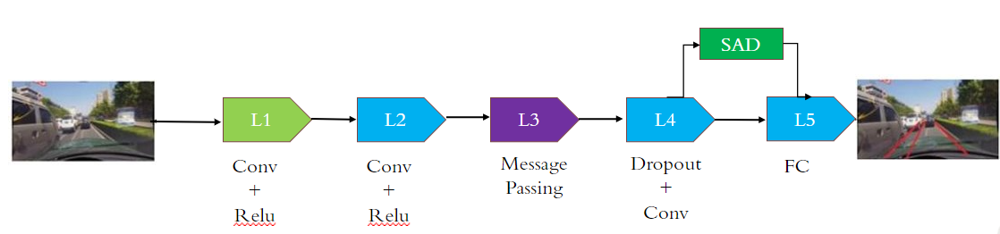

# SCNN-SAD Pytorch
 Pytorch implementation of "[Learning Lightweight Lane Detection CNNs by Self Attention Distillation (ICCV 2019)](https://arxiv.org/abs/1908.00821)"




You can find the previous version [here](https://github.com/InhwanBae/ENet-SAD_Pytorch/tree/f4e07c6298cafffbfd33fbd006ebffeec99e7432)


## Demo
#### Video


Demo trained with CULane dataset & tested with \driver_193_90frame\06051123_0635.MP4

`gpu_runtime: 0.016253232955932617 FPS: 61`

`total_runtime: 0.017553091049194336 FPS: 56` on RTX 2080 TI

#### Comparison
| Category | 40k episode (before SAD)                  | 60k episode (after SAD)                  |
| -------- | ----------------------------------------- | ---------------------------------------- |
| Image    |       |       |
| Lane     |  |  |


## Train
### Requirements
* pytorch
* tensorflow (for tensorboard)

### Datasets

* [CULane](https://xingangpan.github.io/projects/CULane.html)
  <details><summary>CULane dataset path (click to expand)</summary>
  
  ```
  CULane_path
  ├─ driver_100_30frame
  ├─ driver_161_90frame
  ├─ driver_182_30frame
  ├─ driver_193_90frame
  ├─ driver_23_30frame
  ├─ driver_37_30frame
  ├─ laneseg_label_w16
  ├─ laneseg_label_w16_test
  └─ list
  ```
</details>


You need to change the correct dataset path in `./config.py`
```python
Dataset_Path = dict(
    CULane = "/workspace/CULANE_DATASET",
"
)
```

### Training
First, change some hyperparameters in `./experiments/*/cfg.json`
```
{
  "model": "enet_sad",               <- "scnn" or "scnn_sad" or "enet_sad"
  "dataset": {
    "dataset_name": "CULane",        <- "CULane" or "Tusimple"
    "batch_size": 12,
    "resize_shape": [800, 288]       <- [800, 288] with CULane, [640, 368] with Tusimple, and [640, 360] with BDD100K
                                        This size is defined in the ENet-SAD paper, any size is fine if it is a multiple of 8.
  },
  ...
}
```

And then, start training with `train.py`
```
python train.py --exp_dir ./experiments/exp1
```


## Acknowledgement
This repo is built upon official implementation [ENet-SAD](https://github.com/cardwing/Codes-for-Lane-Detection) and based on [PyTorch-ENet](https://github.com/davidtvs/PyTorch-ENet), [SCNN_Pytorch](https://github.com/harryhan618/SCNN_Pytorch).
